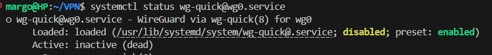
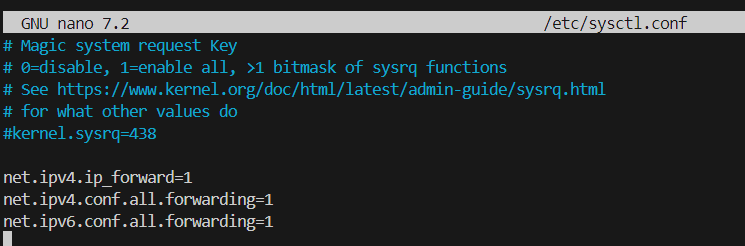
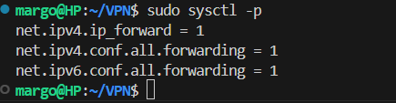
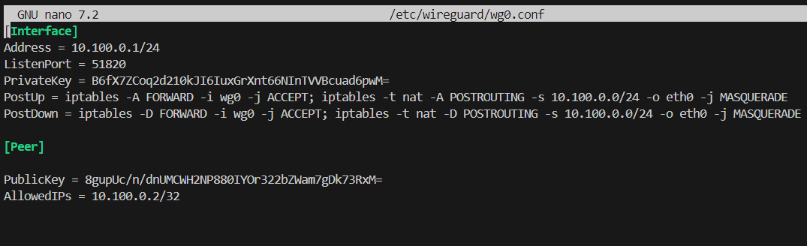
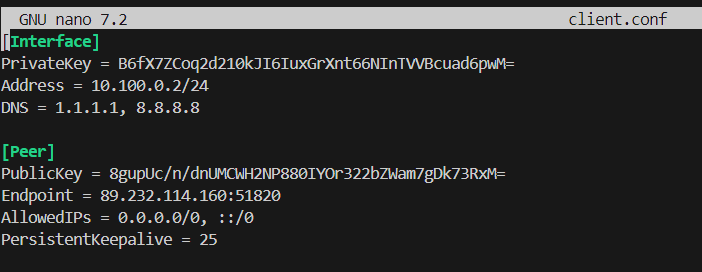
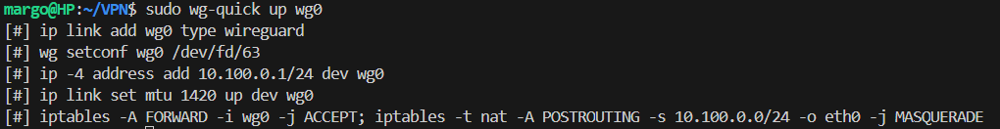
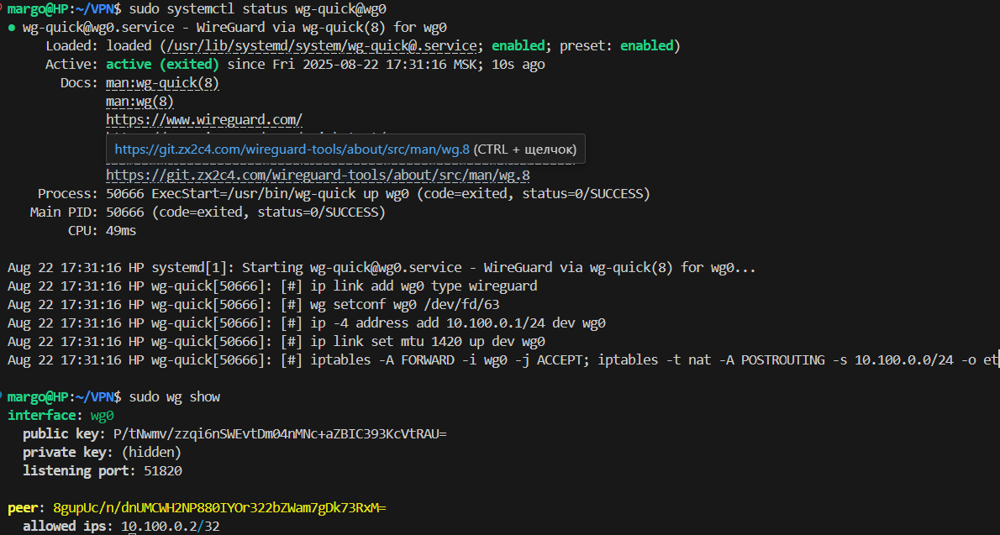
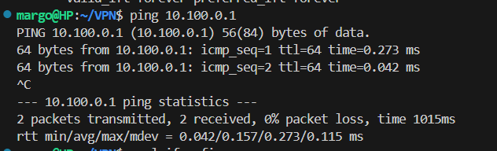

## Разберем, как поднять собственный, быстрый и безопасный VPN-сервер на WireGuard, который, например,  свяжет наши филиалы. Это отличная альтернатива коммерческим решениям так как легкая диагностика, современная безопасность,скорость и производительность,простота,кроссплатформенность

### 1. Установка и базовая настройка
Ставим сам WireGuard:

Проверяем, что сервис пока неактивен (это нормально):

Разрешаем перенаправление пакетов в ядре. Редактируем конфиг:

### Добавляем в конец файла строки:

### Применяем изменения без перезагрузки

## 2. 🔑 Генерация ключей

### Сразу кладём ключи в нужную директорию, чтобы не потерять.

## Для сервера:

## Для клиента:

## ⚙️ Конфигурация сервера (/etc/wireguard/wg0.conf)
Создаем и редактируем конфиг:

### Вставляем следующее, заменив your_server_priv_key на содержимое server_private.key, а your_client_pub_key на содержимое client_public.key.

PostUp/PostDown — добавляют и удаляют правила iptables для NAT, чтобы клиенты могли выходить в интернет через сервер.
   AllowedIPs  — разрешаем клиенту использовать только этот конкретный IP.

## Конфигурация клиента (client.conf)
Теперь создадим конфиг для клиента (например, прямо в домашней директории).

### Перезапуск WireGuard на сервере и добавляем в автозагрузку командой: sudo systemctl enable wg-quick@wg0

Проверяем статус смотрим состояние туннеля:

## Подключаем клиента
Переносим файл client.conf на устройство с клиентом WireGuard (Windows, macOS, Android, iOS). Импортируем его в приложении и активируем соединение.

Проверка:
Пингуем внутренний IP-адрес сервера:

### Пакеты доходят до сервера (10.100.0.1)
### Нулевая потеря пакетов (0% packet loss)
### Низкая задержка (0.042-0.273 ms) - отличное качество связи

